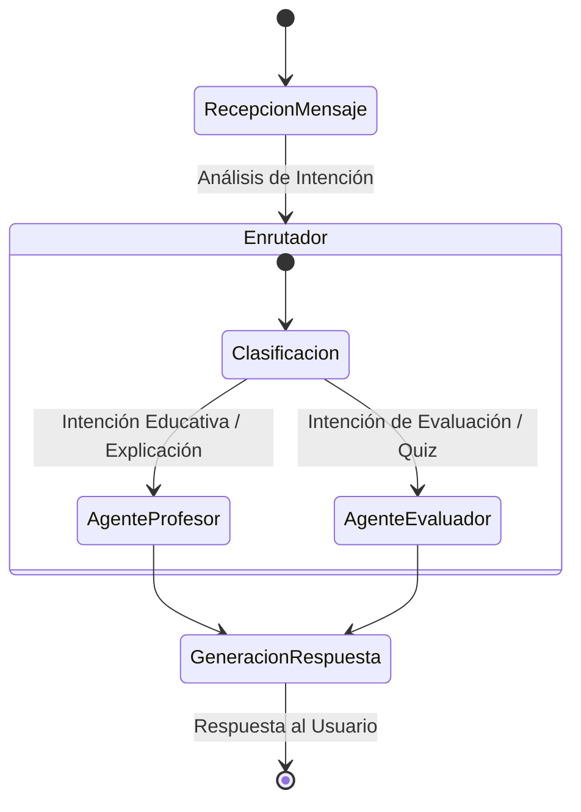

# Diagrama de Interacción de Agentes

```mermaid
stateDiagram-v2
    [*] --> RecepcionMensaje
    RecepcionMensaje --> Enrutador : Análisis de Intención
    
    state Enrutador {
        [*] --> Clasificacion
        Clasificacion --> AgenteProfesor : Intención Educativa / Explicación
        Clasificacion --> AgenteEvaluador : Intención de Evaluación / Quiz
    }
    
    AgenteProfesor --> GeneracionRespuesta
    AgenteEvaluador --> GeneracionRespuesta
    
    GeneracionRespuesta --> [*] : Respuesta al Usuario
```
