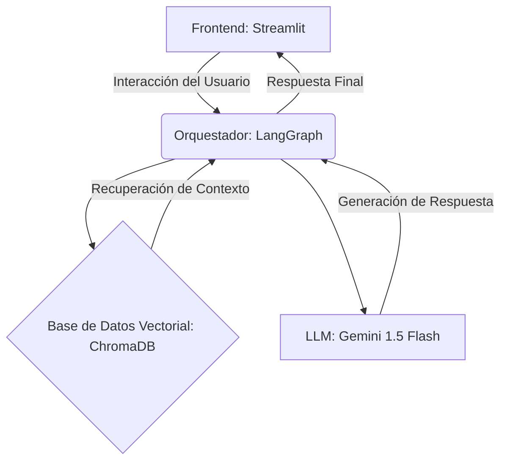

# Diagrama de Arquitectura del Sistema

```mermaid
graph TD
    A[Frontend: Streamlit] -->|Interacción del Usuario| B(Orquestador: LangGraph)
    B --> C{Base de Datos Vectorial: ChromaDB}
    B --> D[LLM: Gemini 1.5 Flash]
    C -->|Recuperación de Contexto| B
    D -->|Generación de Respuesta| B
    B -->|Respuesta Final| A
```
