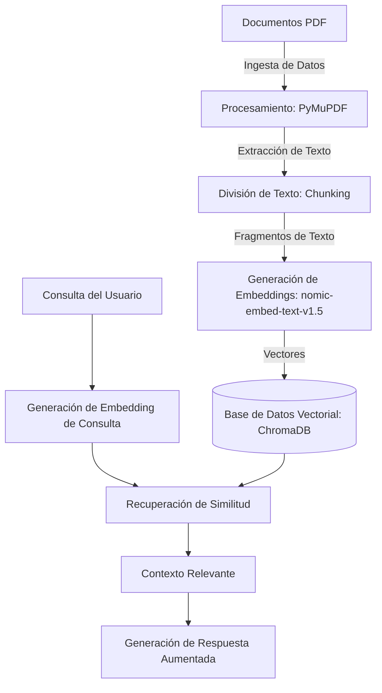

# Diagrama de Flujo RAG (Retrieval-Augmented Generation)

```mermaid
flowchart TD
    A[Documentos PDF] -->|Ingesta de Datos| B[Procesamiento: PyMuPDF]
    B -->|Extracción de Texto| C[División de Texto: Chunking]
    C -->|Fragmentos de Texto| D[Generación de Embeddings: nomic-embed-text-v1.5]
    D -->|Vectores| E[(Base de Datos Vectorial: ChromaDB)]
    F[Consulta del Usuario] --> G[Generación de Embedding de Consulta]
    G --> H[Recuperación de Similitud]
    E --> H
    H --> I[Contexto Relevante]
    I --> J[Generación de Respuesta Aumentada]
```
